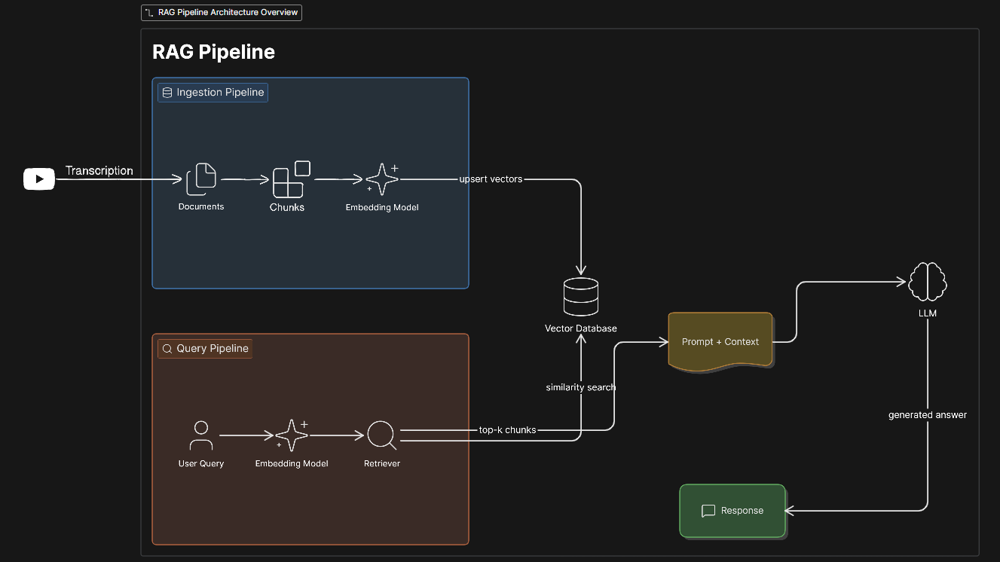

# SaaS Marketing Insights RAG Pipeline 🚀

[](https://nodejs.org/)
[](https://qdrant.tech/)
[](https://ollama.com/)
[](https://www.docker.com/)

A custom Retrieval-Augmented Generation (RAG) pipeline built using **Node.js**, **Ollama**, and **Qdrant**. This project scrapes, cleans, chunks, and indexes YouTube video transcripts focusing on **SaaS marketing strategies** (such as high-converting GTM playbooks). It retrieves contextually relevant snippets to ground local LLM generation, eliminating hallucinations and providing tactical, results-based business advice.

---

## 🏗️ System Architecture



---

## 🛠️ Tech Stack & Key Choices

- **Runtime**: Node.js (ES Modules syntax).
- **Core LLM**: Local LLM (e.g. Llama-based or Gemma) orchestrated locally via **Ollama**.
- **Embedding Model**: `nomic-embed-text` (768-dimensional vector space) via Ollama.
- **Vector Database**: **Qdrant** running containerized inside **Docker** for fast, high-performance Cosine similarity search.
- **Web Scraping & DOM**: `cheerio` & `axios` for target acquisition.
- **Metadata-Enriched Chunks**: Instead of arbitrary character-splitting, transcripts are broken into logical segments featuring **Summaries** and **Questions** to align vector search closer to user queries.

---

## 📂 Project Directory Structure

```text
├── docker-compose.yml          # Container configuration for Qdrant
├── package.json                # Project dependencies and script endpoints
├── src/
│   ├── VectorDBUtils/
│   │   └── VectorDB.js         # Connection, collection generation, search & upsert APIs
│   ├── data/
│   │   ├── data-processor.js   # Embedding generator, chunk loader & content formatting
│   │   ├── data-scrapper.js    # YouTube transcript scrapper & cleaner
│   │   └── knowledge-base/
│   │       ├── chunk_data/     # Pre-made, manually curated structured JSON chunks
│   │       └── raw-data/
│   │           └── cleaned-data/ # Extracted and stripped transcript files
│   └── pipeline/
│       └── main.js             # Ingestion setup and interactive Query-Response runner
```

---

## 🚀 Setup & Execution Guide

### 1. Prerequisites
Ensure you have the following installed on your system:
- **Node.js** (v18.x or higher)
- **Docker & Docker Compose**
- **Ollama** running locally

### 2. Boot up Qdrant (Docker Container)
Start the vector database instance in the background:
```bash
docker-compose up -d
```
*This exposes the REST API on port `6333` and the gRPC gateway on `6334` with persistent volume storage mapping.*

### 3. Install Dependencies
Initialize node packages:
```bash
npm install
```

### 4. Fetch the Local Models (via Ollama)
Download your embedding model and your text generation model:
```bash
# Pull the 768-dimensional embedding model
ollama pull nomic-embed-text

# Pull your preferred local LLM (e.g. Llama-based or Gemma model)
ollama pull gemma4:31b-cloud
```

### 5. Running the Chatbot Loop 💬
To start chatting with your SaaS Marketing expert, run:
```bash
node src/pipeline/main.js
```

> [!NOTE]
> **Zero-Config Seeding (First-Time Run)**:
> The script automatically checks your Qdrant collection on startup.
> - **First Run**: If the database is empty, the system automatically runs the ingestion pipeline, vectorizes all manual chunks, and populates Qdrant.
> - **Subsequent Runs**: Ingestion is skipped entirely, taking you straight to the interactive prompt loop in less than a second!

---

## 💬 What Can You Ask?
The chatbot is pre-seeded with transcripts containing real-world growth playbooks, SaaS marketing strategies, and customer acquisition milestones. You can prompt the model with questions like:
- *"How do I validate a B2B SaaS idea before writing code? Explain the 'fake sales call' strategy."*
- *"What is the 'pay after results' offer and how do I implement it?"*
- *"How do I transition early free users of a SaaS into paying customers?"*
- *"How do I scale customer acquisition from 10 to 30 customers using testimonials?"*
- *"What is a distribution engine in SaaS and how do products like GoHighLevel or Zapier use it?"*

---

## 📊 Ingestion & Retrieval Workflow

### Data Structuring (Manual Chunking)
To capture strategic meaning, each chunk is stored with contextual metadata instead of raw text slices:
```json
{
  "chunk_id": 2,
  "videoId": "EsgQ0bQzvZ0",
  "chunk_summary": "The MVP phase: before building the product, define your target customer...",
  "content": "So, like I said, there are phases to this...",
  "questions_on_this_chunk": [
    "What is the MVP phase in SaaS?",
    "How do you validate a SaaS idea without building a product?",
    "What is the fake sales call strategy?"
  ]
}
```

### Querying & Context Injection
The search service extracts a `768` dimension embedding of the user's prompt, queries the Qdrant database using cosine similarity, and formats the result into a clean context box:
```javascript
// Example Prompt Context structure fed to the LLM
SYSTEM: You are an expert SaaS marketing advisor.
CONTEXT:
==============================
CONTEXT 1
==============================
Similarity Score: 0.892
Summary: The MVP phase...
Content: [Transcript text...]
Related Questions: - What is the fake sales call strategy?

USER: [User Prompt]
ANSWER:
```
The answer is then streamed token-by-token directly to your console using Ollama's streaming response API.
